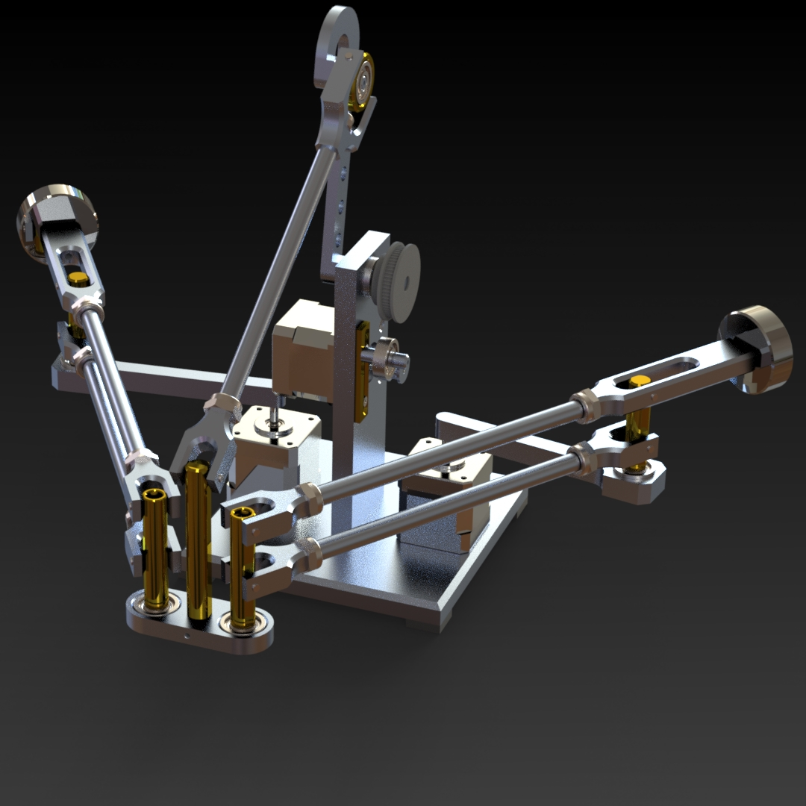
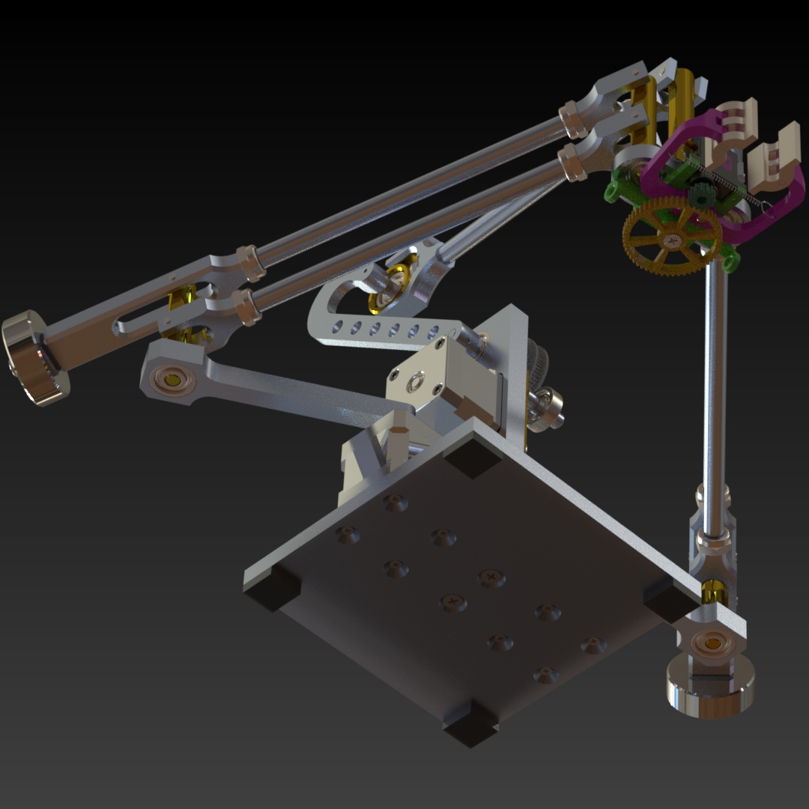
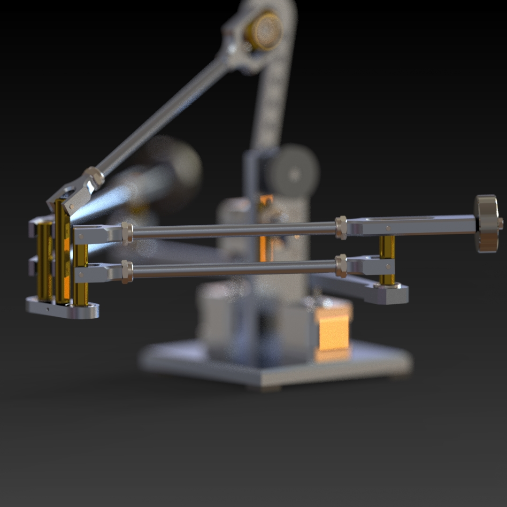
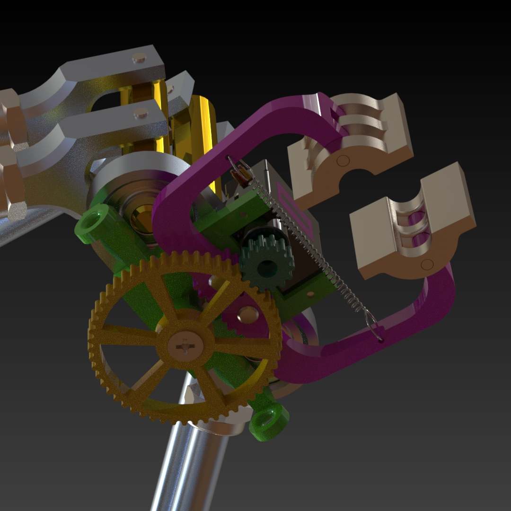
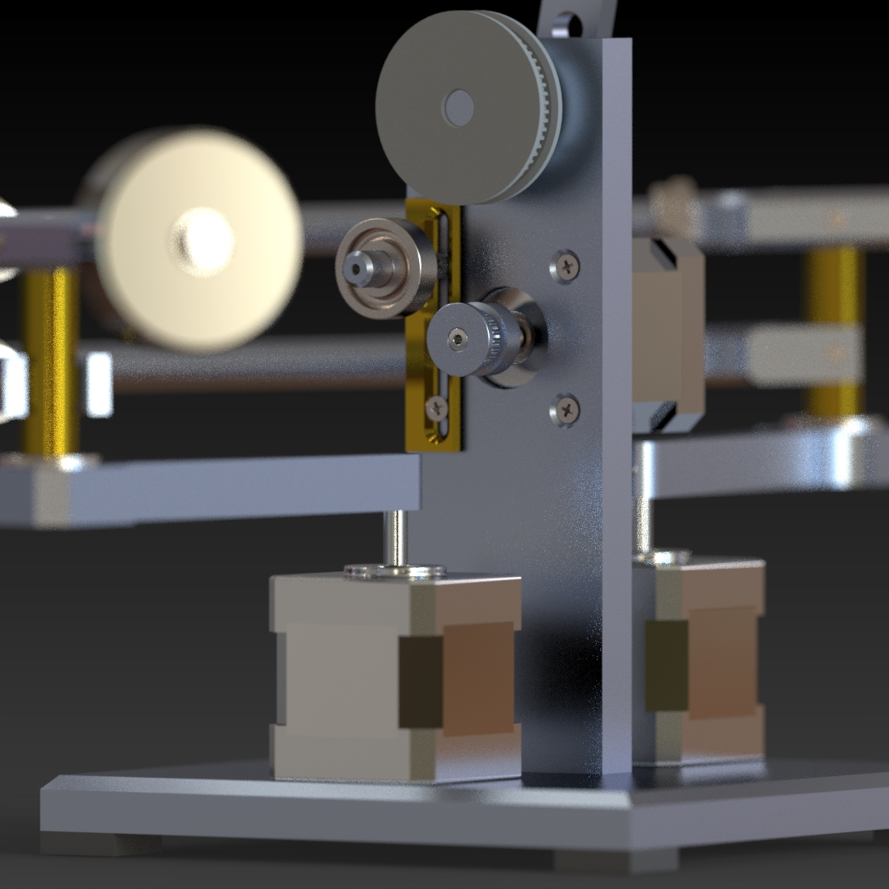
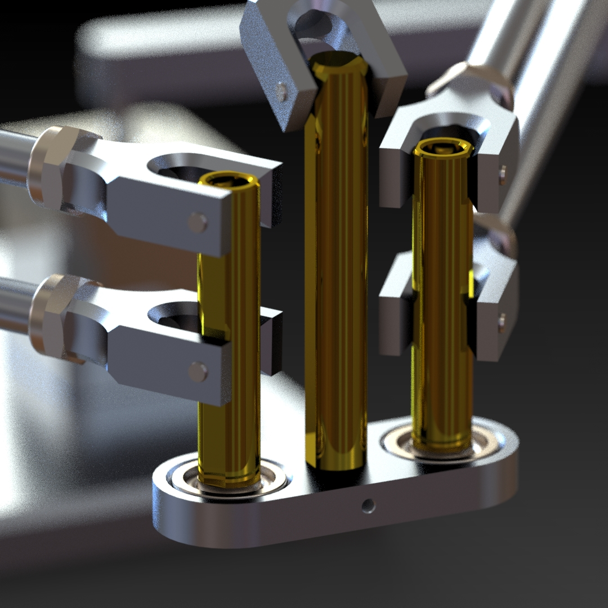
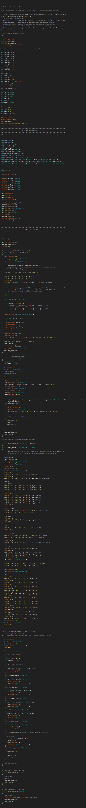
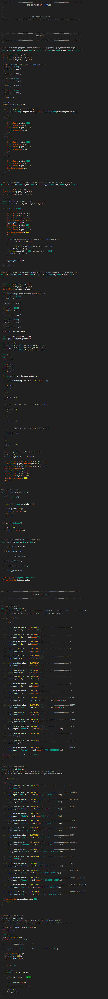
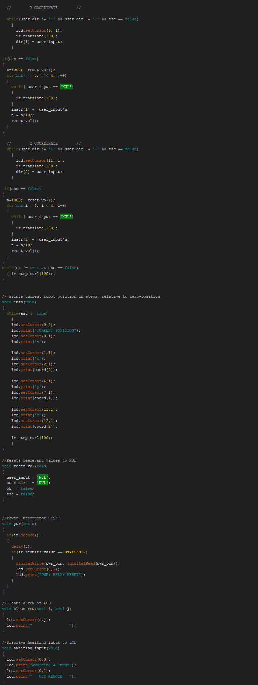

# Pick_and_place_Robot
A robot with original kinematics (Delta - Scara Hybrid)
The design is made such that it can be 3D printed or machined using a lathe and a mill.

**Capabilities**

   1. *Gripper excerts 164g of grip using a 9g servo and a rubber band. (1600N from 90N servo).*
   2. *LCD displays robot position at any stage, and displays robot functions and execution status.*
   3. *Stepper motors can run independently or in syncronization using an original multitasking algorithm.*
   4. *Robot calculates its current position using matrix math, and its able to return to home point at any stage.*
   5. *User can interact with robot via remote control, and drive it in open loop, insert coordinates or execute pre-programmed routines.*   

::::::::::::::::::::::::::::::::::::::::::::::::::::::::::::::::::::::::::::::::::::::::::::::::::::::::::::::::::::::::::::::::::::::::::::::::::::::::::::::::::::::::::::::::::::::::::::::::::::::::::::::::::::::

**Sections**

   1. *Videos*
   2. *3D Model [Solidworks]*
   3. *Code*

::::::::::::::::::::::::::::::::::::::::::::::::::::::::::::::::::::::::::::::::::::::::::::::::::::::::::::::::::::::::::::::::::::::::::::::::::::::::::::::::::::::::::::::::::::::::::::::::::::::::::::::::::::::

**Videos**

   **Demonstration of the robot's functions**
   Demo @ min 3:00

   

   **Breakdown of the robot's software w/ Demo**
   Demo @ min 7:00

   

::::::::::::::::::::::::::::::::::::::::::::::::::::::::::::::::::::::::::::::::::::::::::::::::::::::::::::::::::::::::::::::::::::::::::::::::::::::::::::::::::::::::::::::::::::::::::::::::::::::::::::::::::::::

**3D Model [Solidworks]**

::::::::::::::::::::::::::::::::::::::::::::::::::::::::::::::::::::::::::::::::::::::::::::::::::::::::::::::::::::::::::::::::::::::::::::::::::::::::::::::::::::::::::::::::::::::::::::::::::::::::::::::::::::::

**Robot's Code**

**END OF README**
